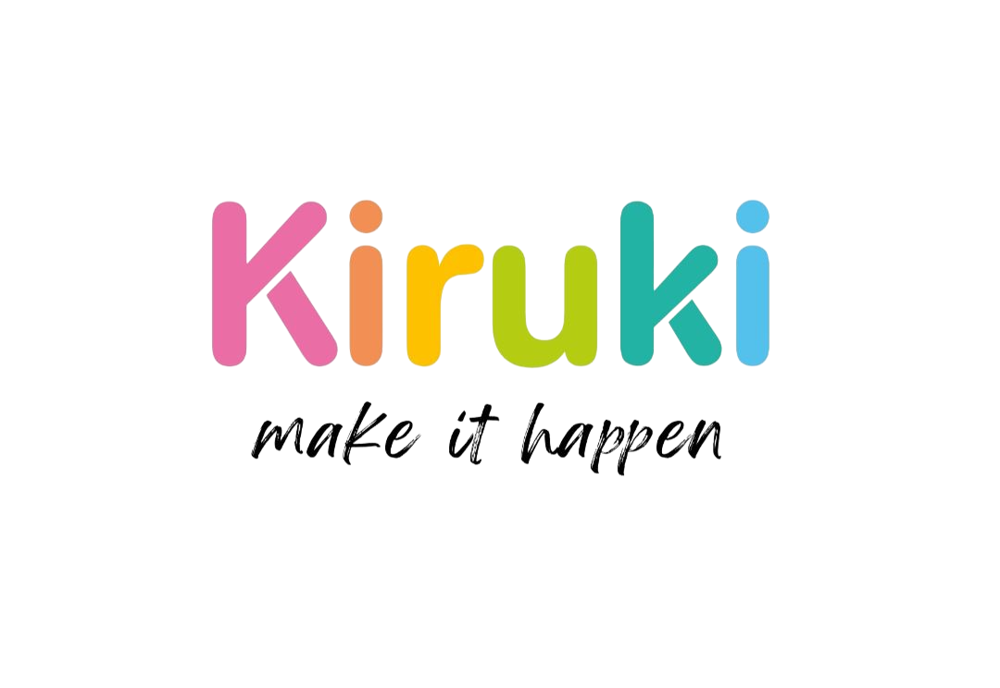
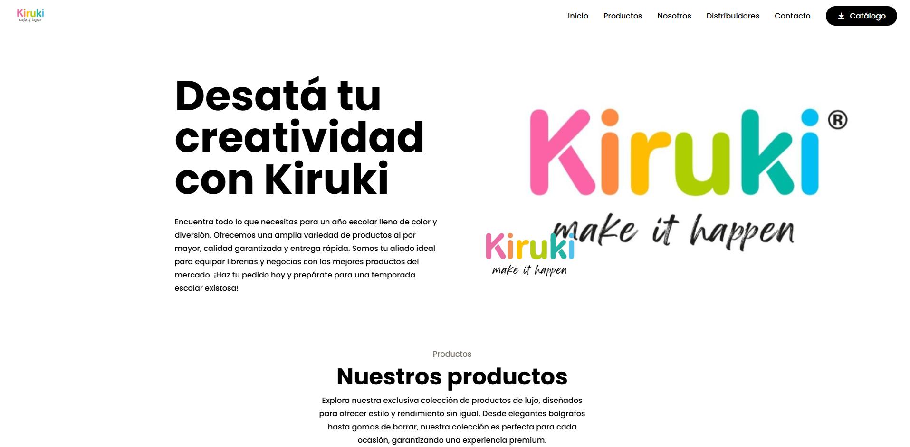
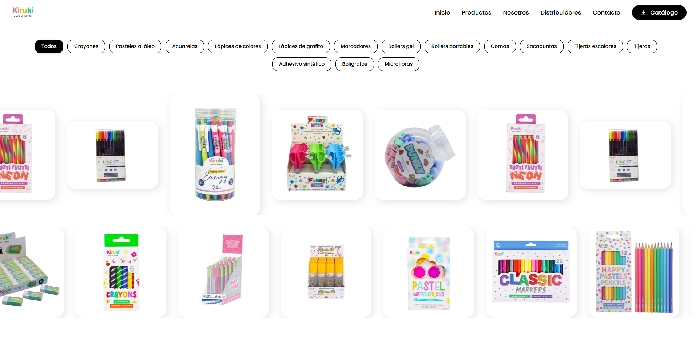
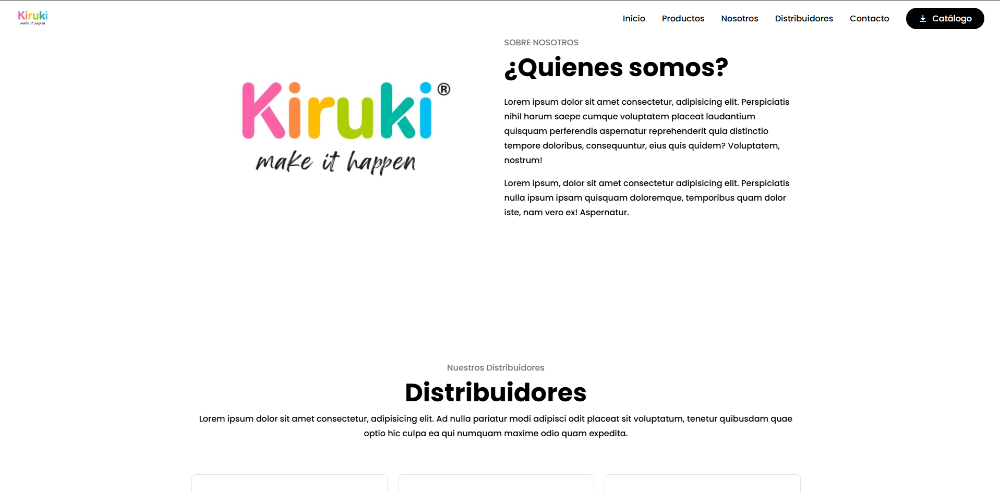
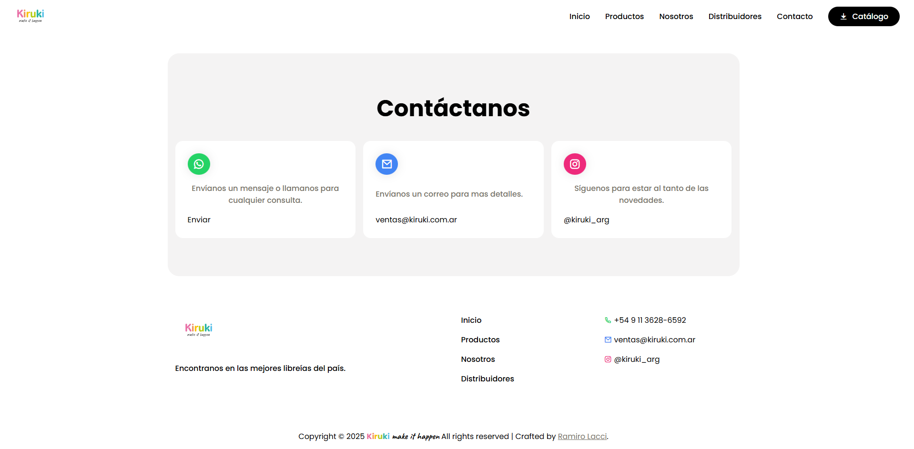

  

  # Kiruki - Make It Happen 🎨
  
  *Desata tu creatividad con Kiruki*

  
  
  
  

  [Explorar la Web](#vision-general) •
  [Características](#caracteristicas-principales) •
  [Tecnologías](#tecnologias) •
  [Catálogo](#catalogo-de-productos)

 

## 🌟 Visión General

**Kiruki** es una marca de artículos escolares y de librería diseñada para llevar color, creatividad y rendimiento al día a día. Esta plataforma web funciona como el portal oficial de la marca, presentando una amplia gama de productos, desde herramientas artísticas hasta elementos básicos de escritura y oficina.

El sitio está diseñado con un enfoque moderno y dinámico, permitiendo a los distribuidores y clientes explorar las categorías de productos, conocer sobre la marca y descargar el catálogo oficial actualizado.

 

## 📸 Vista Previa

| | |
|:---:|:---:|
|  |  |
| *Sección Inicio — Hero con logo y descripción* | *Sección Productos — Filtros y galería* |
|  |  |
| *Sección Nosotros y Distribuidores* | *Sección Contacto y Footer* |

 

## ✨ Características Principales

- 📱 **Diseño Totalmente Responsivo:** Una experiencia fluida en dispositivos móviles, tablets y escritorio.
- 🖼️ **Carruseles Dinámicos:** Integración de Swiper.js para visualizar colecciones de productos y testimonios de distribuidores de forma interactiva.
- 🔍 **Filtrado Avanzado:** Sistema de filtrado por categorías (crayones, marcadores, acuarelas, etc.) para una navegación rápida y precisa.
- 🎨 **Estilo Visual Moderno:** Tipografías exclusivas y diseño elegante que refleja la esencia creativa de la marca.
- 📥 **Descarga de Catálogo:** Acceso directo al catálogo oficial de Kiruki en formato PDF.

 

## 🛠️ Tecnologías

El proyecto ha sido desarrollado utilizando tecnologías web estándar, garantizando un rendimiento óptimo y portabilidad:

- **HTML5:** Estructura semántica.
- **CSS3 (Vanilla):** Estilos personalizados, animaciones y diseño responsivo usando Flexbox/Grid.
- **JavaScript (Vanilla):** Lógica de filtrado de productos e interacciones de la interfaz.
- **Swiper.js:** Para la gestión táctil y fluida de los sliders.
- **Remix Icon:** Conjunto de iconos minimalistas.
- **Google Fonts:** Fuentes (Caveat, Satisfy, Shadows Into Light) para un toque artístico.

 

## 📦 Catálogo de Productos

La colección de Kiruki abarca diversas categorías para satisfacer todas las necesidades creativas y académicas:

*   🖍️ **Arte y Color:** Crayones, Pasteles al óleo, Acuarelas, Lápices de colores, Marcadores.
*   ✏️ **Escritura Regular:** Lápices de grafito, Bolígrafos, Microfibras.
*   🖋️ **Escritura Especializada:** Rollers gel, Rollers borrables.
*   ✂️ **Útiles Esenciales:** Gomas de borrar, Sacapuntas, Tijeras (escolares y regulares), Adhesivo sintético.

 

## 🚀 Cómo Empezar (Desarrollo)

Para visualizar o modificar este proyecto localmente, los pasos son muy simples ya que no requiere dependencias pesadas ni procesos de construcción complejos.

1. **Clonar o descargar el repositorio**
2. **Abrir el proyecto:** 
   Puedes simplemente abrir el archivo `index.html` en tu navegador de preferencia.
   
   *Opcional:* Para una mejor experiencia de desarrollo, utiliza una extensión como **Live Server** en VS Code:
   *   Haz clic derecho en `index.html`
   *   Selecciona "Open with Live Server"

 

---

  <i>Hecho con creatividad y color para la temporada escolar.</i>

