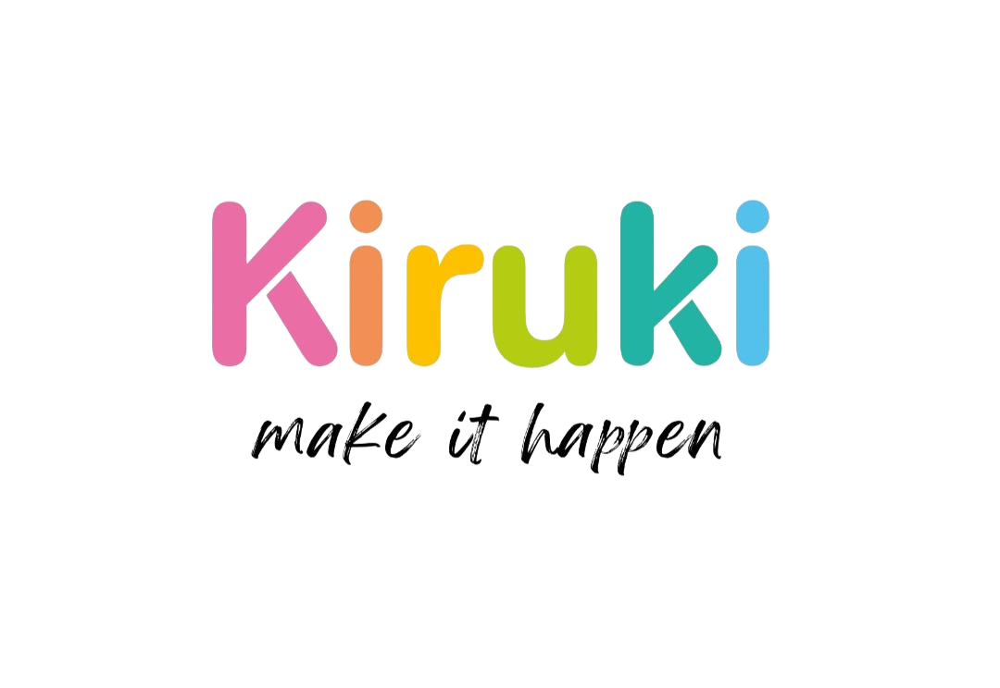
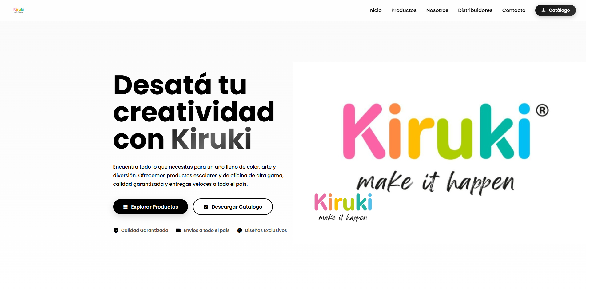
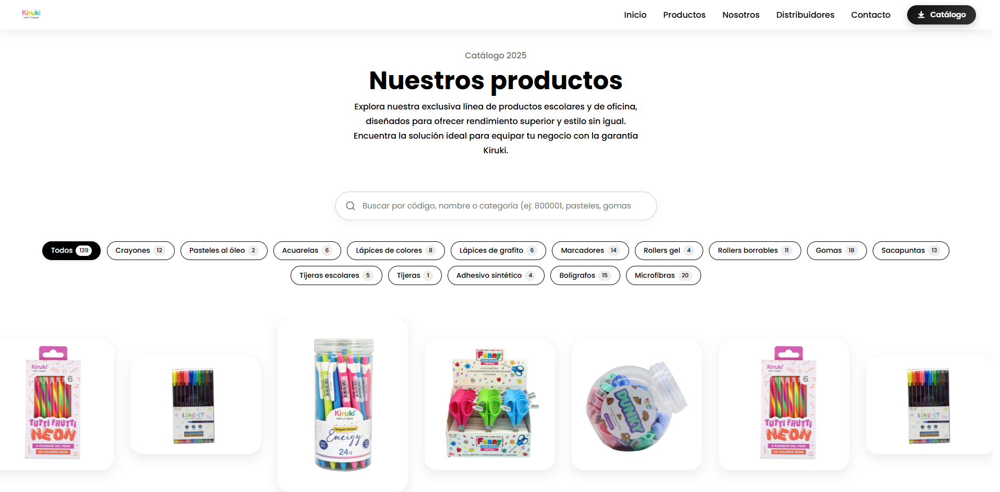
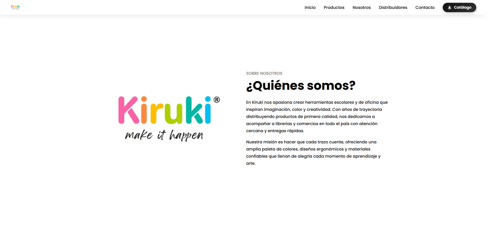
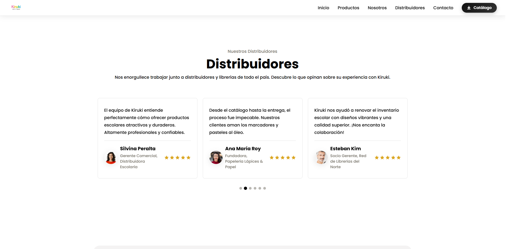
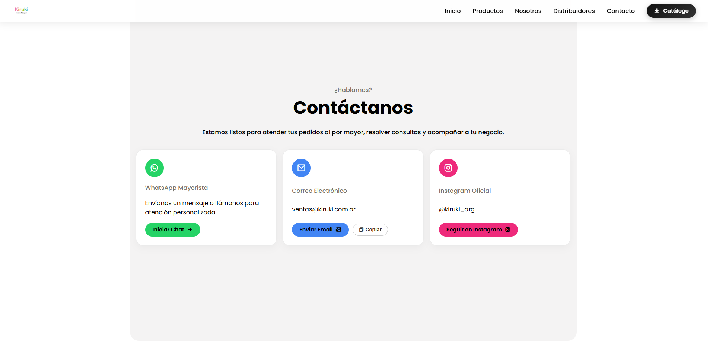

  

> **Plataforma web corporativa y catálogo digital interactivo para productos escolares, de arte y oficina Kiruki.**

  
  
  
  
  

---

## 📸 Galería del Sitio Web

<table width="100%">
  <tr>
    <td width="50%" align="center">
      
       <b>Hero Principal — Inicio</b>
    </td>
    <td width="50%" align="center">
      
       <b>Catálogo de Productos & Filtros</b>
    </td>
  </tr>
  <tr>
    <td width="50%" align="center">
      
       <b>Sección Quiénes Somos</b>
    </td>
    <td width="50%" align="center">
      
       <b>Red de Distribuidores Kiruki</b>
    </td>
  </tr>
  <tr>
    <td width="100%" colspan="2" align="center">
      
       <b>Contacto Mayorista & Canales Directos</b>
    </td>
  </tr>
</table>

---

## ✨ Destacados de la Plataforma

* 🎨 **Estética Premium & Glassmorphism:** Interfaz moderna con acabados translúcidos, tipografía limpia y gradientes dinámicos.
* ⚡ **Animaciones Fluidas (GSAP + ScrollTrigger):** Transiciones suaves y revelación progresiva de elementos al desplazarse.
* 🔍 **Buscador & Filtros en Tiempo Real:** Filtrado instantáneo por categorías y barra de búsqueda interactiva.
* 🔄 **Carruseles Interactivos (Swiper.js):** Muestrarios de productos y opiniones de distribuidores con interacción táctil.
* 📱 **Diseño 100% Responsivo:** Experiencia visualmente equilibrada tanto en escritorio como en dispositivos móviles.
* 💬 **Contacto Directo por WhatsApp:** Accesos rápidos para clientes mayoristas y descarga directa de catálogo en PDF.

---

© 2026 **Kiruki** — *Make It Happen*. Todos los derechos reservados.
